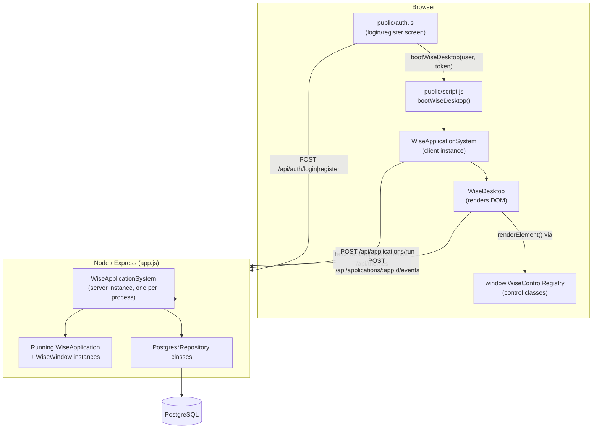
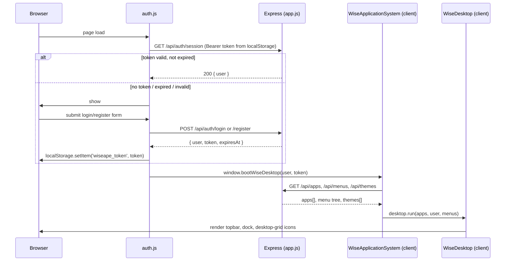
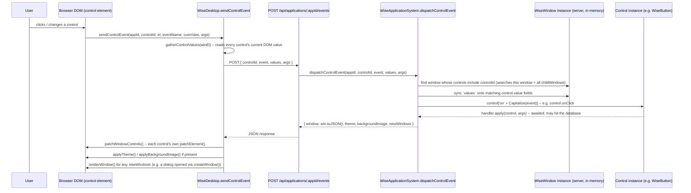
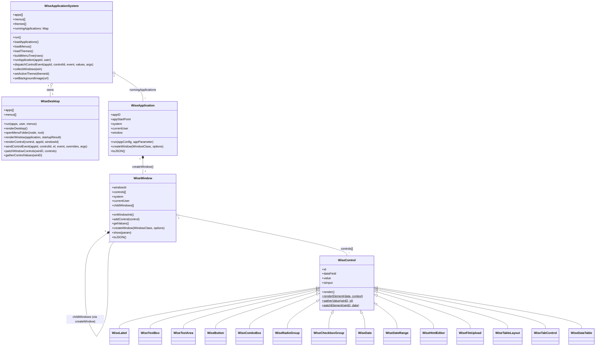
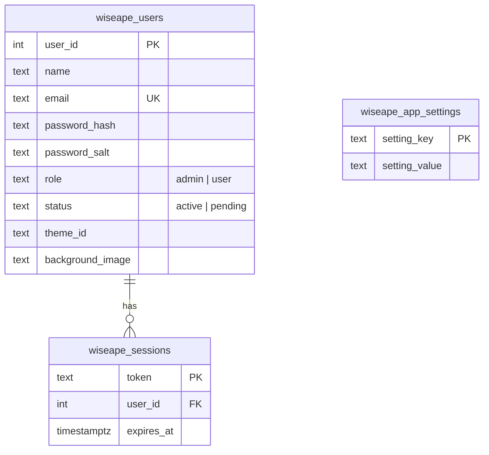
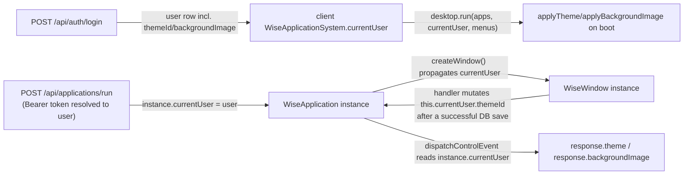
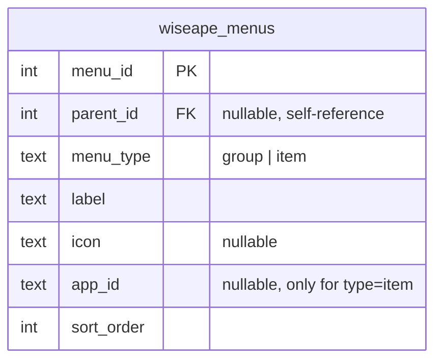

# Wiseape Application System (WAS) — Architecture

> Audience: this document is written for an AI coding agent (or a human
> developer) who needs to understand WAS well enough to modify it safely.
> It explains *why* the system is shaped the way it is, not just what each
> file does — the "why" is what prevents an agent from "fixing" something
> that is actually load-bearing.

## 1. What WAS is

Wiseape Application System is a **browser-based desktop OS simulation**.
A single Node/Express server renders a desktop UI (dock, wallpaper, window
manager) in the browser, and lets you install "applications" — server-side
JS classes that build windows full of UI controls (labels, buttons, text
boxes, data tables, ...). Application logic (event handlers, database
access) runs **on the server**; the browser only renders DOM and forwards
user interactions back to the server. There is no client-side app logic to
write — an app author writes one thing: a server-side window/app class.

Think of it as "a tiny window-manager + a tiny UI-control framework +
generic RPC for control events", all hand-rolled, all plain JavaScript, no
build step, no framework dependency (no React/Vue/etc).

## 2. Core design decisions (read this before changing anything)

These are the load-bearing decisions. If you're about to "simplify"
something that looks unusual, check this list first — it's very likely
unusual on purpose.

1. **Isomorphic files.** Most files under `system/` and `system/controls/`
   run *both* in Node (server) and in the browser (client), from the exact
   same source file. Each file starts with
   `const isBrowser = typeof window !== 'undefined';` and branches on it.
   The server `require()`s the file normally; the browser loads it via a
   plain `<script src="...">` tag (Express serves `system/*.js` and
   `system/controls/*.js` directly — see §7).

2. **IIFE wrapper on every control file.** Every file in
   `system/controls/*.js` is wrapped in `(function () { ... })();`. This is
   **not** stylistic. Classic `<script>` tags all share one global lexical
   scope in the browser; without the IIFE, two control files declaring
   `const isBrowser = ...` at top level would collide with a
   `SyntaxError: Identifier 'isBrowser' has already been declared`, and
   *every control file after the first would silently fail to load*. This
   bug was hit once during development and is why the wrapper exists —
   never remove it.

3. **No client-side business logic, ever.** An app author never writes a
   client-side event handler or a client-side data-fetch. All control event
   handlers (`onClick`, `onChange`, `onRowSelect`, ...) are plain server-side
   methods on a `WiseWindow` subclass. The browser's only job for an event
   is: gather current form values → POST them to the server → apply
   whatever DOM patch the server sends back. This was an explicit product
   requirement during development ("I don't want a `clientBehaviors`
   registry — a programmer should be able to attach *any* function as an
   event handler without also registering it on the client"). See §5 for
   the exact mechanism.

4. **Every control owns its own rendering.** `WiseDesktop` (and the server)
   never contains per-control-type rendering logic. Each control class in
   `system/controls/*.js` implements its own `render()` (server → JSON),
   `static renderElement()` (JSON → DOM), `static gatherValue()` (DOM →
   value), and `static patchElement()` (fresh JSON → update DOM). WiseDesktop
   just looks the class up by type name in a registry and calls the method.
   Adding a new control type never requires touching `WiseDesktop.js`.

5. **A container control MUST override `patchElement`.** A control that
   holds other controls (`WiseTableLayout`, `WiseTabControl`, `WiseDataTable`
   for its toolbar) has its own child controls nested inside its DOM
   subtree. If it doesn't override `patchElement` to delegate to its
   children, it inherits the base class's generic implementation, which
   treats the whole container as a single value node and does
   `el.textContent = ''`, wiping out every nested child on the very next
   unrelated event anywhere in the same window. This exact bug was found
   and fixed once (`WiseTableLayout`) — see `system/controls/WiseTableLayout.js`
   and `WiseTabControl.js` for the required pattern.

## 3. High-level architecture



Two separate `WiseApplicationSystem` instances exist at runtime:

- **Server instance** — created once in `app.js`'s `start()`. Holds the
  Postgres repositories, `apps`, `menus`, `themes`, and a
  `runningApplications` map. Lives for the whole process lifetime, shared by
  every HTTP request (see §9 for why this matters).
- **Client instance** — created once per browser tab in
  `public/script.js`, after login. Holds no database access; it only
  fetches JSON from the server and renders it via `WiseDesktop`.

## 4. Boot sequence



Key files: `public/auth.js` (login/register/auto-login UI + logic),
`public/script.js` (defines `window.bootWiseDesktop`, called once auth
succeeds), `system/WiseApplicationSystem.js#run()`.

**"Automatic login kalau belum expired"** works entirely through
`GET /api/auth/session`: the browser always has *a* token in localStorage
after a first login (30-day expiry, see `PostgresAuthRepository`), and every
page load re-validates it against `wiseape_sessions` before deciding whether
to show the login screen at all.

## 5. The control-event round trip (the core mechanism)

This is the single most important flow to understand. It is what lets an
app author write `onClick: this.mySaveHandler.bind(this)` and have it "just
work" as a real server-side method call, with no client-side registration
of any kind.



Important details baked into this flow:

- **Handler resolution is generic.** `dispatchControlEvent` computes
  `` `on${Capitalize(eventName)}` `` and looks it up **on the control
  instance**, not on the window. For an app-author-supplied handler (the
  overwhelmingly common case — `onClick`, `onChange`, `onRowSelect`,
  `onDataFilterChanged`, ...), that property is a function the app author
  already bound to the window with `.bind(this)`, so `this` inside the
  handler is the window regardless of what `dispatchControlEvent` binds it
  to. For a few built-in *control-class* methods (`WiseDataTable.onCellClick`
  / `onCellChange`, used for button/checkbox/combobox/radio table columns),
  the method is unbound, so `dispatchControlEvent` explicitly does
  `handler.apply(control, args)` so `this` resolves to the control itself
  (letting it read `this.columns`/`this.data`).
- **`args` carries real positional parameters.** Beyond the generic
  `values` sync (control id → current value, used to keep sibling controls
  in sync before running the handler), an event can also carry an `args`
  array that becomes the handler's actual function parameters — e.g.
  `onRowSelect(rowData)` or `onDataFilterChanged(pageSize, currentPage)`.
  This is threaded end-to-end:
  `WiseDesktop.sendControlEvent(..., eventArgs)` → request body `args` →
  `dispatchControlEvent(..., args)` → `handler.apply(control, args)`.
- **The handler is `await`ed.** `dispatchControlEvent` is `async` and does
  `await handler.apply(...)`. This is what lets a handler perform a real
  database write (e.g. `WiseDataTable`'s cell `onChange` saving an edit, or
  `WinSettings`'s theme picker persisting to the user's row) and have that
  write actually finish before the HTTP response — and therefore the DOM
  patch — goes out.
- **Windows opened via `createWindow()` are discovered automatically.**
  `dispatchControlEvent` snapshots `windowId`s before running the handler
  and diffs against `collectWindows(instance.window)` (which recurses into
  every window's `childWindows`) afterward. Anything new is returned in
  `newWindows` and rendered by the client — this is how a window can open
  *another* window (a dialog, an "About" box, ...) from inside an event
  handler with zero extra plumbing from the app author.
- **Theme/background echo is per-user, not global.** The response's
  `theme`/`backgroundImage` fields are read from `instance.currentUser`
  (the user who opened this running app instance), not from a shared
  system-wide setting — see §8.

## 6. Class map



Full method-by-method reference: see `docs/API_REFERENCE.md`.

## 7. How files reach the browser

`applications/**` is **never** statically served — it holds server-side
Node code (`require()`d directly by `resolveApplicationClass`) and must not
be exposed as raw downloadable files. Instead, `app.js` whitelists exactly
what the browser is allowed to fetch:

| Route | Serves |
|---|---|
| `express.static('public/')` | everything under `public/` (HTML, CSS, `auth.js`, `script.js`, uploaded background images) |
| `GET /WiseDesktop.js` | `system/WiseDesktop.js` |
| `GET /WiseApplicationSystem.js` | `system/WiseApplicationSystem.js` |
| `GET /controls/:file` | `system/controls/<file>.js`, regex-whitelisted to `^Wise[A-Za-z]+\.js$` |
| `GET /app-assets/:appId/icon.svg` | that app's own `assets/icons/icon.svg`, resolved from its `appStartPoint` — see §10 |

`public/index.html` loads all of the above via plain `<script>` tags, in a
specific order: `WiseControl.js` first (every other control class extends
it), then the rest of the controls, then `WiseDesktop.js`, then
`WiseApplicationSystem.js`, then `script.js`, then `auth.js`.

## 8. Authentication, sessions, and per-user state

Schema (all in `system/PostgresAuthRepository.js`):



- Passwords are hashed with Node's built-in `crypto.scryptSync` (salted,
  per-user salt) — no external hashing dependency.
- A session token is a random 32-byte hex string, valid 30 days
  (`SESSION_TTL_MS`), checked via `findValidSession` (a join against
  `wiseape_sessions` filtering `expires_at > now()`).
- `wiseape_app_settings` currently holds exactly one row,
  `registration_requires_approval` — toggled from the admin-only section of
  the Settings app (`applications/Settings/forms/WinSettings.js`), read by
  `PostgresAuthRepository.createUser()` to decide whether a new signup's
  `status` starts as `'active'` or `'pending'`.
- The seeded admin account: `miftahul.huda@devoteam.com`, created
  automatically by `ensureSchema()` the first time the auth tables are
  touched.

**Per-user theme/background propagation** — this is the part most likely to
surprise someone extending the system, since the server has exactly *one*
`WiseApplicationSystem` instance shared by every connected browser:



The `currentUser` object attached to a running `WiseApplication`/`WiseWindow`
is a **snapshot fetched at `runApplication()` time**, not a live query. If a
handler changes the user's stored preference (see
`WinSettings.onThemeChange`), it must also update that same in-memory
`this.currentUser` object so subsequent events *in that same running app
instance* echo the correct value back. This avoids re-querying the database
on every unrelated event, but it means: **whenever you write a handler that
changes something on `currentUser` in the database, mutate
`this.currentUser` in place afterward too.**

## 9. Known architectural limitation: one running instance per appId

`WiseApplicationSystem.runningApplications` is a single `Map<appId,
WiseApplication instance>`, shared by the whole Node process. Every time
`runApplication(appId, user)` runs (i.e. every time *any* browser session
opens app X), it **overwrites** the previous entry for that `appId`.

Practical consequence: if two different logged-in users (or two browser
tabs) have the same app open at the same time, control events from the
*first* tab's window will be dispatched against whatever instance is
currently in the map — which may by then belong to the *second* tab's
session. This is a pre-existing, deliberately-not-yet-fixed limitation
(flagged during development, not something introduced by accident) — fixing
it properly would mean keying `runningApplications` by something like
`(appId, userId, windowId)` instead of just `appId`, plus deciding how the
client tracks which instance its own window belongs to. If you're asked to
support genuinely concurrent multi-user use of the same app, **this is the
first thing to fix** — don't patch around it downstream.

## 10. Per-app colorful icons

Every application folder can carry its own icon:

```
applications/<AppName>/assets/icons/icon.svg
```

`GET /app-assets/:appId/icon.svg` (in `app.js`) resolves an app's folder
from its `appStartPoint` (e.g.
`applications/HelloWorld/AppHelloWorld.js:AppHelloWorld` → folder
`applications/HelloWorld`) and serves that file if it exists, 404s
otherwise. `WiseDesktop.getIconMarkup()` always tries
`/icon.svg">` first for anything with an
`appId` (real apps, and menu items linked to one — **not** menu
groups/folders, which have no app to link to and always use the folder
glyph); if that image fails to load, an `onerror` handler swaps in the
original hand-drawn monochrome SVG glyph as a fallback, and an `onload`
handler adds an `icon-loaded` class that strips the surrounding
colored-box/border framing (`public/styles.css`) — that framing exists only
to make the plain glyph fallback visible against the wallpaper; a real icon
file already looks complete on its own.

Icon SVGs are drawn on a `128×128` canvas, edge-to-edge (a full
`rx="28"` rounded rect background, no inset margin), so there's no gap for
the container's own background to show through.

## 11. The menu system

Desktop icons and Launchpad are driven by a **menu tree**, not the flat app
list (`system/PostgresMenuRepository.js`, table `wiseape_menus`):



- A `group` row is a folder; an `item` row links to an app via `app_id`.
- Groups can nest arbitrarily deep (`parent_id` self-reference).
- `WiseApplicationSystem.buildMenuTree(rows)` turns the flat row list into a
  nested tree and resolves each node's effective icon: an explicit `icon`
  column wins; otherwise an `item` inherits its linked app's `appIcon`, and
  a `group` defaults to a folder glyph (`📁`).
- `WiseDesktop`'s desktop-grid rendering and Launchpad (`openMenuFolder`)
  both consume this same tree — Launchpad is literally
  `openMenuFolder({ type: 'root', children: this.menus }, root)`, so the two
  views can never drift apart.
- The **dock** (taskbar) is intentionally *not* menu-driven — it stays a
  flat quick-launch strip of every installed app, by design (a deliberate
  scoping decision: "Desktop tidak menampilkan aplikasi, tapi menampilkan
  menu" was about the desktop surface specifically).

## 12. Repository pattern (all `system/Postgres*Repository.js` files)

Every repository follows the same shape — copy this pattern for a new one
rather than inventing a new style:

1. Constructor reads DB connection config from `process.env` (`DB_HOST`,
   `DB_NAME`, `DB_USER`, `DB_PASSWORD`, `DB_PORT`), with **no hardcoded
   credentials** (this repo is public on GitHub — credentials live only in
   the gitignored `.env`).
2. `async connect()` — lazily creates a `pg.Client`, and **always** attaches
   `client.on('error', ...)` that nulls out `this.client` instead of letting
   the error propagate. Without this, a dropped connection (idle timeout,
   network blip) crashes the entire Node process via Node's default
   unhandled-EventEmitter-error behavior. This exact bug happened once in
   development — never omit this handler on a new repository.
3. `async ensureTable(client)` / `ensureSchema(client)` — idempotent
   `CREATE TABLE IF NOT EXISTS`, seeds demo/default rows if the table is
   empty, memoizes with a `this.tableReady`/`this.schemaReady` flag so it
   only actually hits the DB once per process.
4. Every public method wraps its query in `try/catch` and falls back to an
   in-memory default list on failure (`PostgresAppRepository`,
   `PostgresThemeRepository`, `PostgresEmployeeRepository`,
   `PostgresMenuRepository`) — the desktop should never completely fail to
   boot just because the DB is briefly unreachable. (`PostgresAuthRepository`
   is the one exception — auth failures should be loud, not silently
   faked.)

## 13. File/folder map

```
app.js                          Express server: all routes, one process-wide
                                 WiseApplicationSystem instance
public/
  index.html                    Script tags, load order, login/register markup
  styles.css                    Desktop/dock/window chrome + login screen CSS
                                 (controls themselves are styled with Tailwind
                                 utility classes directly in their renderElement)
  auth.js                       Login/register UI + localStorage token + auto-login
  script.js                     window.bootWiseDesktop(user, token)
  uploads/                      User-uploaded background images (gitignored contents)
system/
  WiseApplicationSystem.js      Orchestrator -- isomorphic (see §1)
  WiseDesktop.js                Desktop/dock/window-chrome rendering -- isomorphic
  WiseApplication.js            Base class for an installed app
  WiseWindow.js                 Base class for a window
  Postgres*Repository.js        One per concern: Apps, Themes, Employees, Auth, Menu
  controls/
    WiseControl.js              Base control class + registry bootstrap
    Wise*.js                    One file per control type (see docs/API_REFERENCE.md)
applications/
  <AppName>/
    App<AppName>.js             extends WiseApplication, implements run()
    forms/
      Win<Name>.js               extends WiseWindow, implements onWindowInit()
    assets/icons/icon.svg        Optional colorful app icon (see §10)
docs/
  ARCHITECTURE.md                This file
  DEVELOPMENT_GUIDE.md            Tutorial for building a new WAS application
  API_REFERENCE.md                Class/method reference
```
